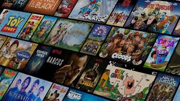

# Front-end da aplicação ScreenMatch

Essa é a aplicação Front-end que será utilizada no curso.

Foi desenvolvida pela [Monica Hillman](https://cursos.alura.com.br/user/monicahillman)

Para visualizar a mesma, após o download ou clone do projeto, abra-a com o VS Code

Caso não possua, instale a extensão *Live Server*.

Feito isso, clique com o botão direito no arquivo **index.html** e escolha "Open with Live Server".

A princípio, caso a sua API ainda não esteja desenvolvida, o conteúdo que você verá será esse abaixo:

Após a finalização do curso, seu projeto estará completo, já com as séries cadastradas e a API com as rotas prontas. Sendo assim, a aplicação irá mostrar os dados, de forma similar à abaixo:

# Bons estudos!
<h1>ScrennMatch</h1>

 

 

<h2>O que é?</h2>

Aplicação BackEnd em Java onde é possível pesquisar, filtrar séries e episódios

 e salvar em um banco de dados PostgreSQL

<h2>Tecnologias</h2>

 

